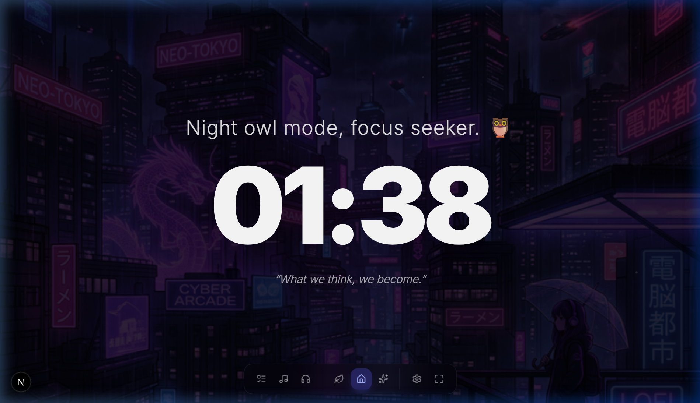
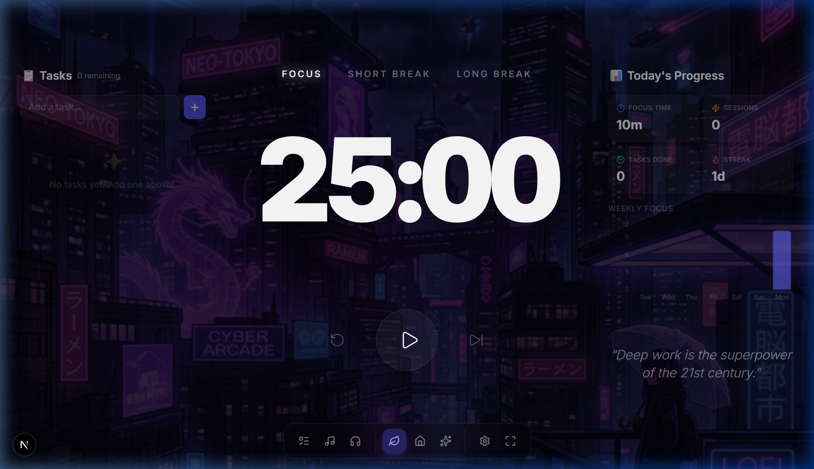
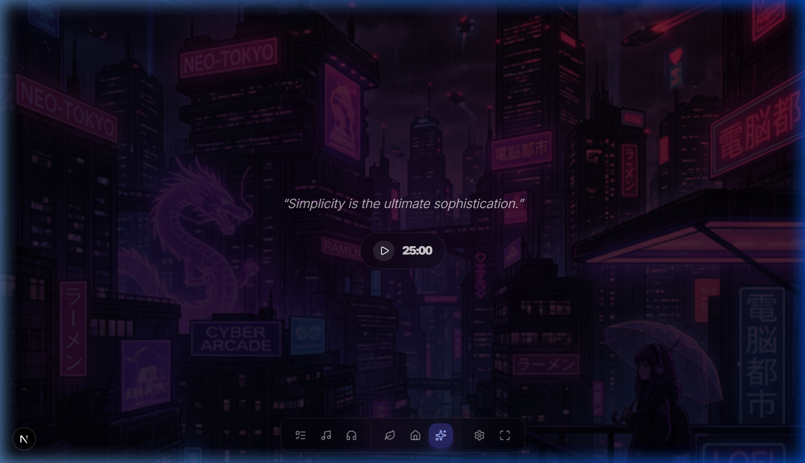

# LawZen: My Personal Focus & Anti-Procrastination Web Application

Hi! I built this web application as a personal project. Before this, I found myself constantly struggling with procrastination and losing track of time while trying to study and work. Standard timers and to-do lists just weren't cutting it for me, so I decided to take matters into my own hands and build the exact tool I needed.

Lawzen is a custom Pomodoro timer and task manager built to help me (and hopefully you!) stay focused, track progress across different sessions, and actually get things done. 

## App Layouts

### Home Mode


### Focus Mode


### Ambient Mode


## Features that keep me on track:

- **Customizable Pomodoro Timers:** Focus intervals, short breaks, and long breaks, designed to structure study sessions effectively.
- **Multiple Modes:** 
  - **Focus Mode:** A distraction-free layout with just the timer, tasks, and essential stats.
  - **Ambient Mode:** A relaxed, atmospheric view to keep a lighter track of time.
  - **Home Mode:** A welcoming dashboard with inspirational quotes and current progress.
- **Built-in Task Manager:** Keep track of what needs to be done right alongside the timer.
- **Daily Stats & Streaks:** Visualizing my daily focus time, completed tasks, and keeping up a streak motivates me to keep showing up.
- **Beautiful & Immersive Themes:** Several curated visual and audio themes (complete with ambient sounds) to get into the right headspace.

## Tech Stack

I built this project to challenge myself and learn modern web development. It uses:
- **Next.js & React:** For a fast, responsive, and dynamic user interface.
- **Tailwind CSS:** For styling everything exactly the way I wanted.
- **Zustand:** For managing the app's state (timers, tasks, settings) simply and effectively.
- **Framer Motion:** For adding smooth, satisfying animations.

## Getting Started

If you want to run this locally and try it out yourself:

1. Clone this repository.
2. Install the dependencies:
   ```bash
   npm install
   ```
3. Run the development server:
   ```bash
   npm run dev
   ```
4. Open [http://localhost:3000](http://localhost:3000) with your browser.

---

*Built to beat procrastination, one focused session at a time.*
